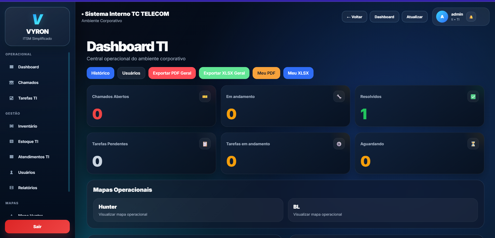
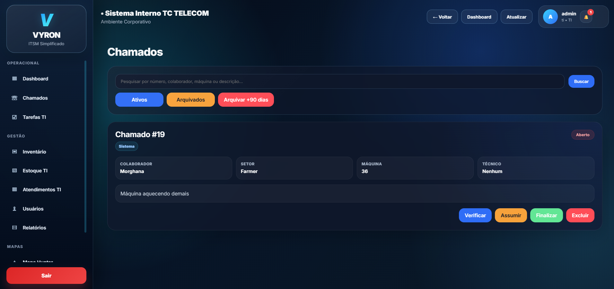
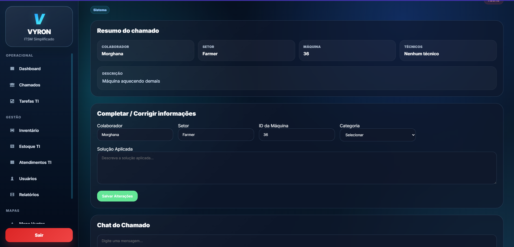
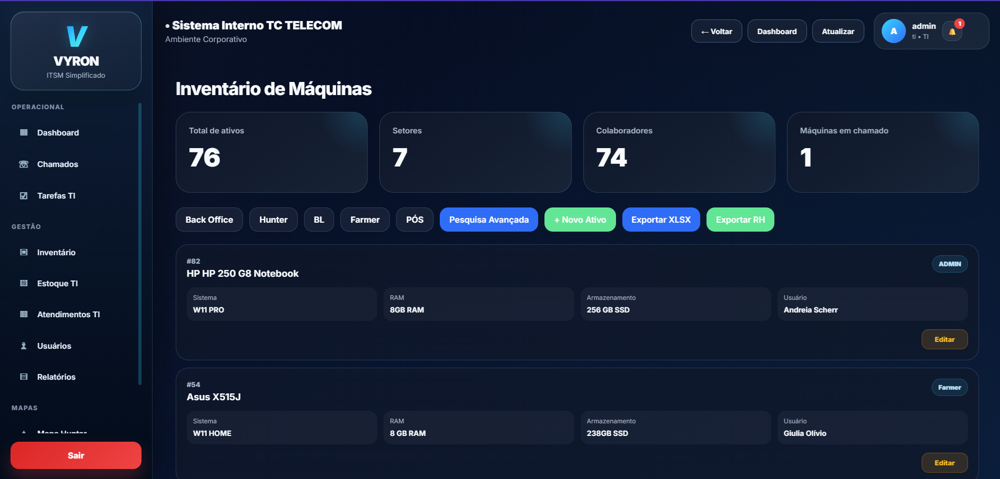
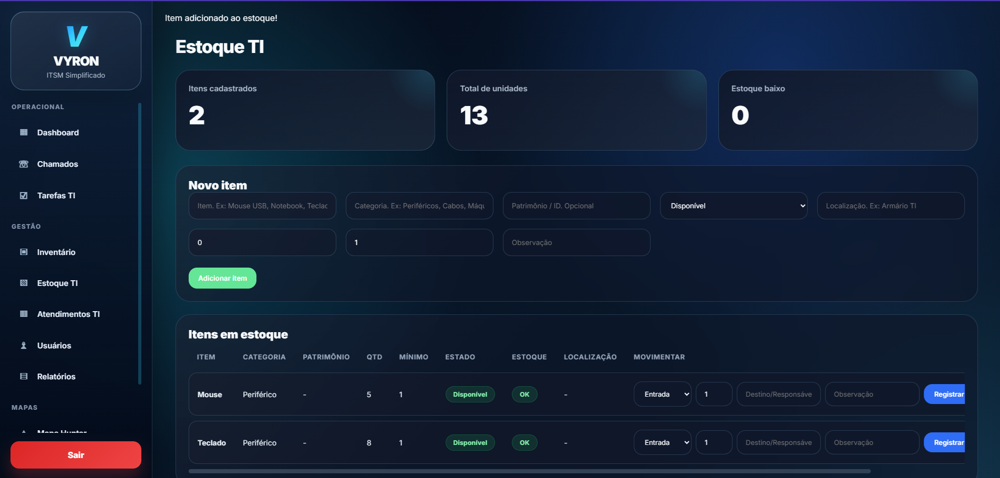
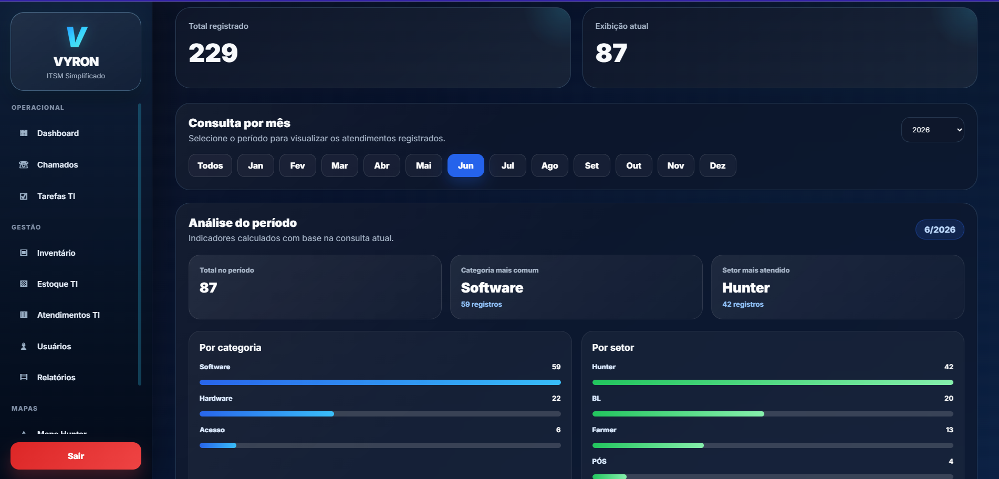
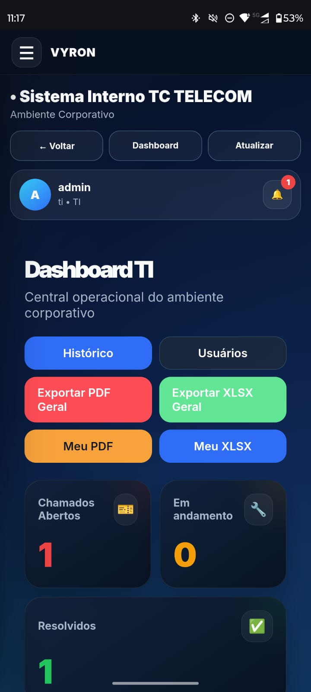

# Demonstração do Vyron ITSM


O **Vyron ITSM Demo** é uma plataforma demonstrativa de gestão interna de TI, desenvolvida com **Flask, PostgreSQL, Docker e Jinja2**.

O sistema centraliza processos de suporte técnico, chamados, inventário de ativos, estoque de TI, atendimentos técnicos, dashboards, permissões de usuários, notificações e exportações em XLSX.

> Esta versão foi higienizada para portfólio. Dados sensíveis, credenciais, backups, uploads e informações internas foram removidos ou substituídos por dados fictícios/demonstrativos.

---

## Preview



---

## Sobre o projeto

O Vyron nasceu a partir de uma necessidade prática de centralizar rotinas internas de suporte técnico em um único sistema.

A proposta é oferecer uma plataforma simples, funcional e expansível para equipes de TI acompanharem chamados, ativos, movimentações, estoque, atendimentos e indicadores operacionais.

A versão demo mantém a estrutura principal do sistema, mas remove qualquer informação sensível da versão real, permitindo sua exposição como projeto de portfólio.

---

## Funcionalidades

### Chamados técnicos

* Abertura e acompanhamento de chamados.
* Controle de status.
* Associação de técnicos responsáveis.
* Registro de mensagens e interações.
* Anexo de evidências.
* Finalização e reabertura de chamados.
* Abertura rápida via QR Code.

### Inventário de ativos

* Cadastro e consulta de máquinas.
* Registro de marca, modelo, sistema operacional, memória RAM e armazenamento.
* Associação de ativos a usuários e setores.
* Pesquisa avançada por filtros.
* Histórico relacionado ao ativo.

### Mapa operacional

* Visualização de posições de trabalho.
* Associação entre máquina, colaborador e setor.
* Movimentação de equipamentos.
* Apoio à gestão física dos ativos.

### Estoque de TI

* Controle de itens disponíveis.
* Registro de entradas e saídas.
* Quantidade mínima por item.
* Histórico de movimentações.
* Apoio ao controle de periféricos, equipamentos reserva e materiais técnicos.

### Atendimentos técnicos

* Registro manual de atendimentos realizados.
* Filtro por mês, setor, categoria e técnico.
* Mini dashboard com análise do período.
* Importação de planilhas.
* Exportação XLSX formatada.

### Usuários e permissões

* Perfis de acesso por tipo de usuário.
* Fluxo de login.
* Troca e reset de senha.
* Controle de usuários ativos.
* Separação de acessos entre TI, administração e colaboradores.

### Dashboard operacional

* Indicadores de chamados.
* Visão geral da operação de TI.
* Rankings e resumos.
* Cards visuais.
* Interface responsiva para uso em desktop e celular.

### Exportações

* Relatórios em XLSX.
* Exportações formatadas para consulta e apresentação.
* Apoio à geração de indicadores internos.

---

## Screenshots

### Gestão de chamados



### Detalhe do chamado



### Inventário de ativos



### Estoque TI



### Atendimentos técnicos



### Interface mobile



---

## Tecnologias utilizadas

* Python
* Flask
* Flask-SQLAlchemy
* PostgreSQL
* Docker
* Docker Compose
* Jinja2
* HTML5
* CSS3
* JavaScript
* OpenPyXL
* Pandas

---

## Estrutura geral

```txt
vyron-itsm-demo/
│
├── app.py
├── requirements.txt
├── docker-compose.yml
├── Dockerfile
├── README.md
├── .gitignore
├── .env.example
├── seed_demo_users.py
│
├── templates/
│   ├── base.html
│   ├── login.html
│   ├── dashboard_ti.html
│   ├── chamados.html
│   ├── detalhe.html
│   ├── inventario.html
│   ├── estoque.html
│   ├── atendimentos.html
│   └── ...
│
├── static/
│   ├── css/
│   ├── img/
│   ├── manifest.json
│   └── service-worker.js
│
└── docs/
    └── screenshots/
```

---

## Como rodar o projeto

### 1. Clonar o repositório

```bash
git clone https://github.com/Rabellooh/vyron-itsm-demo.git
```

```bash
cd vyron-itsm-demo
```

### 2. Criar o arquivo `.env`

Copie o arquivo de exemplo:

```bash
cp .env.example .env
```

No Windows, também é possível criar manualmente um arquivo `.env` com base no `.env.example`.

### 3. Subir os containers

```bash
docker compose up --build
```

### 4. Acessar no navegador

```txt
http://localhost:5001
```

---

## Ambiente demo isolado

A versão demo utiliza containers e portas próprias para evitar conflito com ambientes locais existentes:

* Aplicação: `http://localhost:5001`
* PostgreSQL demo: `localhost:5433`
* Banco: `vyron_demo`

---

## Acesso demo

| Perfil        | Usuário            | Senha    |
| ------------- | ------------------ | -------- |
| TI / Master   | admin.demo         | admin123 |
| Técnico TI    | tecnico.demo       | ti123    |
| Administração | administracao.demo | adm123   |
| Colaborador   | colaborador.demo   | demo123  |

> As credenciais acima são genéricas e existem apenas para facilitar a avaliação da versão demonstrativa.

---

## Criar usuários demo

Após o banco estar configurado, os usuários demonstrativos podem ser criados com:

```bash
docker compose exec web python seed_demo_users.py
```

Esse script cria ou atualiza os usuários de demonstração com senhas genéricas e perfis específicos para teste.

---

## Variáveis de ambiente

Exemplo de configuração:

```env
DATABASE_URL=postgresql://postgres:postgres@db:5432/vyron_demo
SECRET_KEY=change-me-demo-secret-key

MAIL_SERVER=smtp.example.com
MAIL_PORT=587
MAIL_USERNAME=demo@example.com
MAIL_PASSWORD=change-me
MAIL_DEFAULT_SENDER=demo@example.com
MAIL_USE_TLS=True

DEMO_MODE=True
```

---

## Segurança da versão demo

Esta versão foi preparada para exposição pública como portfólio.

Foram removidos:

* Arquivos `.env` reais.
* Credenciais de e-mail.
* App passwords.
* Backups SQL.
* Uploads reais.
* Logs.
* Dados sensíveis.
* Informações internas de operação.

O repositório contém apenas arquivos necessários para demonstrar a estrutura e funcionalidades do sistema.

---

## Roadmap

Melhorias planejadas para evolução do projeto:

* [ ] Modularizar o `app.py` com Flask Blueprints.
* [ ] Implementar migrations com Flask-Migrate.
* [ ] Criar rotina de backup automático.
* [ ] Melhorar auditoria de ações críticas.
* [ ] Criar modo técnico mobile dedicado.
* [ ] Adicionar testes automatizados.
* [ ] Melhorar documentação da arquitetura.
* [ ] Criar seed demo completo com dados fictícios.
* [ ] Evoluir dashboard com indicadores de SLA.
* [ ] Preparar deploy demonstrativo em ambiente cloud.

---

## Aprendizados e objetivos

Este projeto foi desenvolvido com foco em resolver problemas reais de suporte técnico, combinando conhecimentos de desenvolvimento web, banco de dados, infraestrutura, organização operacional e experiência prática em ambiente de TI.

O objetivo da versão demo é apresentar uma solução completa, funcional e evolutiva para portfólio, evidenciando capacidade de desenvolvimento, análise de processos, organização de sistemas internos e preocupação com segurança de dados.

---

## Autor

Desenvolvido por **Gabriel Rabello Costa do Nascimento**.

Projeto criado como parte do portfólio pessoal em desenvolvimento de sistemas, suporte técnico, infraestrutura e soluções internas de TI.
